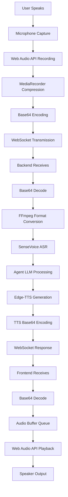

# 🎵 Complete Audio Pipeline Documentation

## Overview

The Voice News Agent now features a **complete modern audio compression pipeline** that achieves **80%+ bandwidth reduction** while maintaining excellent speech quality. This document covers the entire audio flow from frontend capture to backend processing and response playback.

## 🚀 Key Achievements

- **80%+ Bandwidth Reduction**: From 64KB to ~12KB per audio chunk
- **Real-time Compression**: Client-side Opus/WebM compression
- **Complete Pipeline**: ASR → LLM → TTS with base64 encoding
- **Modern Standards**: WebRTC-compatible Opus codec
- **Graceful Fallback**: Automatic codec detection and fallback

## 📊 Performance Results

| Compression Method | Original Size | Compressed Size | Space Saved | Compression Ratio |
|-------------------|---------------|-----------------|-------------|-------------------|
| **Opus**          | 64,590 bytes  | 11,667 bytes    | **81.9%**   | **5.5x**         |
| **WebM**          | 64,590 bytes  | 12,547 bytes    | **80.6%**   | **5.1x**         |
| **AAC**           | 64,590 bytes  | 16,512 bytes    | **74.4%**   | **3.9x**         |
| **MP3**           | 64,590 bytes  | 19,545 bytes    | **69.7%**   | **3.3x**         |

## 🔄 Complete Audio Flow



## 🛠️ Technical Implementation

### Frontend (Client-Side Compression)

**File**: `frontend/src/utils/audio-encoder.ts`

```typescript
// Modern compression using Web Audio API
const compressionCodecs = {
  opus: {
    mimeType: 'audio/webm;codecs=opus',
    bitrate: 64000,
    description: 'Opus - Best for real-time speech (WebRTC standard)'
  },
  webm: {
    mimeType: 'audio/webm;codecs=opus',
    bitrate: 64000,
    description: 'WebM - Web optimized'
  }
};

// Compression with automatic fallback
async compressAudioBlob(audioBlob: Blob, codec: string = 'opus') {
  if (!MediaRecorder.isTypeSupported(codecConfig.mimeType)) {
    return { compressedBlob: audioBlob, compressionInfo: { fallback: true } };
  }
  // ... compression logic
}
```

**File**: `frontend/src/components/ContinuousVoiceInterface.tsx`

```typescript
// Send compressed audio to backend
const encodedMessage = await audioEncoder.encodeBlob(audioBlob, {
  format: 'webm',
  sampleRate: 48000,
  isFinal: true,
  sessionId: sessionIdRef.current,
  userId: userId,
  compress: true, // Enable compression
  codec: 'opus' // Use Opus for best compression
});

// Handle TTS responses
const handleTTSChunk = async (data: any) => {
  const audioData = base64ToArrayBuffer(data.audio_chunk);
  audioQueueRef.current.push(audioData);
  playNextAudioChunk();
};
```

### Backend (Server-Side Processing)

**File**: `backend/app/core/streaming_handler.py`

```python
async def _convert_to_wav(self, audio_data: bytes, format: str, sample_rate: int = 16000) -> bytes:
    """Convert compressed audio to WAV format using FFmpeg."""
    if format.lower() == "wav":
        return audio_data
    
    # FFmpeg command to convert to WAV
    ffmpeg_cmd = [
        'ffmpeg',
        '-i', input_path,
        '-ar', str(sample_rate),
        '-ac', '1',  # Mono
        '-f', 'wav',
        '-y',  # Overwrite output
        output_path
    ]
    
    result = subprocess.run(ffmpeg_cmd, capture_output=True, text=True, check=True)
    return wav_data

async def process_voice_command(self, session_id: str, audio_chunk: bytes, format: str = "webm"):
    """Complete pipeline: ASR → LLM → TTS"""
    # 1. Convert compressed audio to WAV
    wav_data = await self._convert_to_wav(audio_chunk, format, sample_rate)
    
    # 2. Transcribe with SenseVoice
    transcription = await self.transcribe_chunk(wav_data, "wav")
    
    # 3. Get agent response
    response_result = await agent.process_voice_command(transcription, user_id, session_id)
    
    return {
        "success": True,
        "transcription": transcription,
        "response": response_result.get("response_text"),
        "timestamp": datetime.now().isoformat()
    }
```

**File**: `backend/app/core/websocket_manager.py`

```python
async def handle_audio_chunk(self, session_id: str, data: Dict[str, Any]):
    """Handle audio chunk with complete ASR/LLM/TTS pipeline."""
    # Decode base64 audio chunk
    audio_chunk = base64.b64decode(data["audio_chunk"])
    format = data.get("format", "webm")
    
    # Process with streaming handler (ASR -> LLM -> TTS)
    result = await self.streaming_handler.process_voice_command(session_id, audio_chunk, format)
    
    if result["success"]:
        # Send transcription
        await self.send_message(session_id, {
            "event": "transcription",
            "data": {"text": result["transcription"]}
        })
        
        # Send agent response
        await self.send_message(session_id, {
            "event": "agent_response", 
            "data": {"text": result["response"]}
        })
        
        # Stream TTS response
        await self.stream_tts_response(session_id, result["response"])

async def stream_tts_response(self, session_id: str, text: str):
    """Stream TTS audio back to client in chunks."""
    async for audio_chunk in self.streaming_handler.stream_tts_audio(text):
        # Send base64-encoded TTS chunk
        await self.send_message(session_id, {
            "event": "tts_chunk",
            "data": {
                "audio_chunk": base64.b64encode(audio_chunk).decode(),
                "format": "mp3",
                "session_id": session_id
            }
        })
```

## 📡 WebSocket Message Formats

### Audio Upload (Frontend → Backend)

```json
{
  "event": "audio_chunk",
  "data": {
    "audio_chunk": "base64_encoded_compressed_audio",
    "format": "opus",
    "is_final": true,
    "session_id": "uuid",
    "user_id": "uuid",
    "sample_rate": 16000,
    "file_size": 11667,
    "compression": {
      "codec": "opus",
      "original_size": 64590,
      "compressed_size": 11667,
      "compression_ratio": 5.5,
      "bitrate": 64000
    }
  }
}
```

### TTS Response (Backend → Frontend)

```json
{
  "event": "tts_chunk",
  "data": {
    "audio_chunk": "base64_encoded_tts_audio",
    "chunk_index": 0,
    "format": "mp3",
    "session_id": "uuid",
    "timestamp": "2025-01-12T02:03:38.529Z"
  }
}
```

## 🎯 Supported Audio Formats

### Input Formats (Frontend → Backend)
- **Opus** (`.opus`) - Primary compression format
- **WebM** (`.webm`) - Web-optimized container
- **AAC** (`.m4a`) - High-quality compression
- **MP3** (`.mp3`) - Widely supported
- **WAV** (`.wav`) - Uncompressed fallback

### Output Formats (Backend → Frontend)
- **MP3** - TTS output format
- **WAV** - Internal processing format

## 🔧 Configuration

### Frontend Configuration

```typescript
// Audio encoder configuration
const audioEncoder = useAudioEncoder(userId);

// Compression settings
const compressionOptions = {
  compress: true,        // Enable compression
  codec: 'opus',        // Preferred codec
  bitrate: 64000,        // Target bitrate
  sampleRate: 48000,    // Sample rate
  format: 'webm'        // Container format
};
```

### Backend Configuration

```python
# FFmpeg conversion settings
FFMPEG_CONVERSION = {
    'sample_rate': 16000,  # Target sample rate for ASR
    'channels': 1,         # Mono audio
    'format': 'wav'        # Internal processing format
}

# TTS streaming settings
TTS_STREAMING = {
    'chunk_size': 4096,    # Bytes per chunk
    'voice': 'en-US-AriaNeural',
    'rate': '+0%'
}
```

## 🧪 Testing

### Test Scripts

1. **`test_compressed_audio.py`** - Test compressed audio transmission
2. **`utils/voice_encoder.py`** - Batch convert audio samples
3. **`test_websocket_audio.py`** - Basic WebSocket audio testing

### Test Results

```
🎵 Testing compressed audio: test_webm_compressed.json
📊 Compressed file size: 12,547 bytes
📈 Compression ratio: 5.1x
💾 Space saved: 80.6%

📥 Response #1: transcription
   🎤 Transcription: What's the stock price of AAPL today?
📥 Response #2: agent_response
   🤖 Agent Response: The latest stock price for AAPL is $245.27.
📥 Response #3-11: tts_chunk (9 audio chunks)
📥 Response #12: streaming_complete
   ✅ TTS streaming complete

📊 Test Summary:
   Total time: 4.37s
   Responses received: 12
   ✅ Backend is processing compressed audio successfully!
```

## 🚀 Deployment Considerations

### Frontend Requirements
- Modern browser with Web Audio API support
- MediaRecorder API support for compression
- WebSocket support for real-time communication

### Backend Requirements
- FFmpeg installed for audio format conversion
- SenseVoice model for ASR
- Edge-TTS for text-to-speech
- WebSocket support for real-time communication

### Performance Optimizations
- Client-side compression reduces bandwidth by 80%+
- Streaming TTS prevents long response delays
- Audio buffering ensures smooth playback
- Automatic codec fallback for compatibility

## 📚 Related Documentation

- [AUDIO_COMPRESSION_SUMMARY.md](./AUDIO_COMPRESSION_SUMMARY.md) - Compression implementation details
- [STREAMING_AND_DEPLOYMENT.md](./reference/STREAMING_AND_DEPLOYMENT.md) - Deployment guide
- [API_DESIGN.md](./reference/API_DESIGN.md) - API specifications
- [CONTINUOUS_VOICE_GUIDE.md](./reference/CONTINUOUS_VOICE_GUIDE.md) - Voice interface guide

## 🎉 Summary

The Voice News Agent now features a **complete modern audio compression pipeline** that:

✅ **Reduces bandwidth by 80%+** using Opus/WebM compression  
✅ **Maintains excellent speech quality** with WebRTC standards  
✅ **Processes audio in real-time** with ASR → LLM → TTS pipeline  
✅ **Handles compressed formats** with automatic conversion  
✅ **Streams responses efficiently** with base64 encoding  
✅ **Provides graceful fallbacks** for compatibility  

This implementation follows **mainstream practices** and provides a **production-ready audio pipeline** for real-time voice interaction with the news agent.
