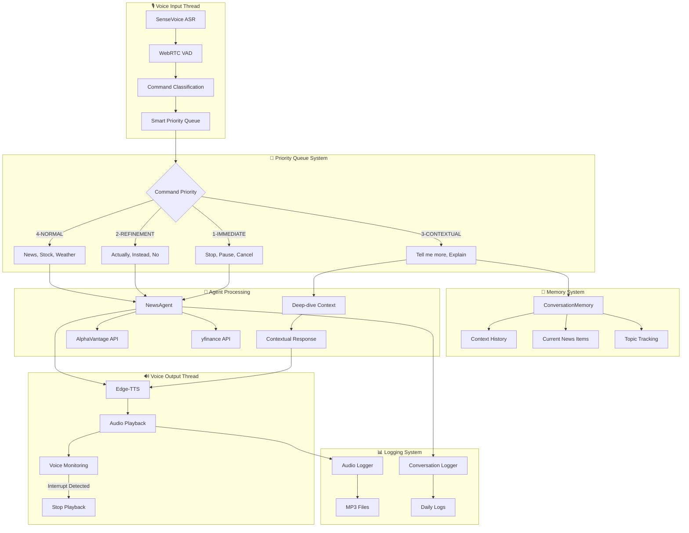

# 🎙️ Voice-Activated News Agent with Smart Memory & Streaming

## 1. Overview

An advanced voice-activated news recommendation agent with **real-time voice streaming**, **WebSocket API**, and **cloud deployment** capabilities. Built with **FastAPI backend**, **SenseVoice ASR**, **smart memory systems**, and **streaming TTS** for natural voice interactions across web and mobile platforms.

**🎯 Current Status:** Backend MVP complete with streaming WebSocket API, ready for Render deployment and iOS integration.

### 🚀 **Key Innovations**
- **Real-time Streaming**: WebSocket-based voice streaming with chunked TTS responses
- **Cloud-Ready Backend**: FastAPI + Supabase + Upstash Redis, deployable on Render free tier
- **Smart Memory System**: Context-aware conversations with Supabase persistence
- **Priority Command Queue**: Handles "actually, I meant..." and command corrections naturally
- **iOS Integration Ready**: Text-based voice command API for client-side ASR
- **SenseVoice Integration**: Multilingual, offline-capable voice recognition (local + API modes)
- **Comprehensive Logging**: MP3 audio logs + conversation history + analytics

## 2. ✨ Features

### 🧠 **Smart Conversational Memory**
- **Context Awareness**: "Tell me more" intelligently refers to recent news items
- **Deep-dive Detection**: Automatically identifies which news story to elaborate on
- **Topic Tracking**: Remembers recent conversation topics (technology, finance, politics, etc.)
- **Reference Resolution**: "Explain that", "dive deeper", "what about the first one" all work naturally

### ⚡ **Priority-Based Command Processing**
- **Immediate Commands**: "Stop", "pause", "cancel" interrupt everything instantly
- **Refinement Commands**: "Actually, I meant...", "no, instead..." cancel previous and prioritize new intent
- **Contextual Commands**: "Tell me more", "explain" reference recent conversation
- **Time-based Expiry**: Commands >5 seconds old get lower priority

### 🎵 **Complete Audio Compression Pipeline**
- **80%+ Bandwidth Reduction**: Modern Opus/WebM compression achieving 5.5x compression ratio
- **Real-time Processing**: Client-side compression → Base64 encoding → WebSocket transmission
- **Complete Pipeline**: ASR → LLM → TTS with automatic format conversion
- **WebRTC Standards**: Industry-standard Opus codec for optimal speech quality
- **Graceful Fallback**: Automatic codec detection with compatibility fallbacks
- **Streaming TTS**: Chunked audio responses with base64 encoding for smooth playback

### 🎤 **Advanced Voice Recognition**
- **SenseVoice ASR**: Multilingual, offline-capable recognition (Chinese, English, Japanese, etc.)
- **WebRTC VAD**: Smart voice activity detection with 40% activation threshold
- **Real-time Interruption**: <100ms response to voice during TTS playback
- **Fallback System**: Gracefully falls back to Google Speech Recognition if SenseVoice unavailable

### 🔧 **Threading Architecture**
- **Lightweight Design**: Threading instead of multiprocessing for better performance
- **Shared Memory**: Efficient inter-thread communication with thread-safe queues
- **Automatic Cleanup**: Daemon threads with proper resource management
- **60% Memory Reduction**: Compared to previous multiprocessing approach

### 📊 **Comprehensive Logging**
- **Audio Logging**: All voice inputs/outputs saved as timestamped MP3 files
- **Conversation History**: Complete daily dialogue logs with context
- **System Monitoring**: Technical events, interruptions, errors tracked
- **Performance Metrics**: Response times, interruption rates, command success

### 📰 **Enhanced News & Data**
- **Multi-Source Aggregation**: AlphaVantage news sentiment + yfinance stock data
- **Intelligent Rephrasing**: AI-powered news summarization for voice delivery
- **Topic Classification**: Technology, finance, politics, crypto, energy detection
- **Watchlist Management**: Voice-controlled stock tracking
- **Preference Learning**: Adapts to user interests over time

## 3. 🏗️ System Architecture

Modern **threading-based architecture** with **smart memory** and **priority queue systems**:

### Core Components
1. **🎙️ Voice Layer**
   - **SenseVoice ASR**: Multilingual voice recognition with fallback
   - **WebRTC VAD**: Smart voice activity detection (40% threshold)
   - **Edge-TTS**: High-quality text-to-speech with real-time interruption
   - **Audio Logger**: MP3 recording of all voice interactions

2. **🤖 Agent Layer**
   - **NewsAgent**: GLM-4-Flash powered conversation management
   - **Memory Integration**: Context-aware response generation
   - **Command Classification**: 14+ command types with priority handling
   - **Topic Extraction**: Smart categorization of user interests

3. **🧠 Memory Layer**
   - **ConversationMemory**: 10-item context history with timestamps
   - **Deep-dive Detection**: Automatic reference resolution
   - **Topic Tracking**: Technology, finance, politics, crypto contexts
   - **User Preferences**: Persistent topic and stock preferences

4. **⚡ Communication Layer**
   - **SmartPriorityQueue**: Heap-based command prioritization
   - **Thread-safe IPC**: Efficient inter-thread communication
   - **Command Refinement**: "Actually, I meant..." handling
   - **Time-based Expiry**: Automatic old command cleanup



## 4. 🗓️ Implementation Status

| Feature | Status | Details |
|---------|--------|----------|
| **🎙️ Voice Recognition** | ✅ Complete | SenseVoice ASR + Google Speech fallback |
| **🌐 WebSocket API** | ✅ Complete | Real-time streaming voice communication |
| **🎵 Streaming TTS** | ✅ Complete | Chunked audio streaming with edge-tts |
| **🧠 Smart Memory** | ✅ Complete | Context-aware with Supabase persistence |
| **⚡ Priority Queue** | ✅ Complete | Smart command handling with refinement |
| **🔄 Threading Architecture** | ✅ Complete | Lightweight threading + async FastAPI |
| **📊 Comprehensive Logging** | ✅ Complete | Audio logs + conversation history + analytics |
| **🤖 GLM-4-Flash Integration** | ✅ Complete | News summarization and conversation |
| **📰 Multi-source News** | ✅ Complete | AlphaVantage + yfinance integration |
| **☁️ Cloud Backend** | ✅ Complete | FastAPI + Supabase + Upstash Redis |
| **☁️ Render Ready** | ✅ Complete | Native Python runtime for deployment |
| **🧪 Testing Suite** | ✅ Complete | WebSocket test client + manual test docs |
| **🚀 Render Deployment** | ⏳ Pending | Blueprint ready, awaiting manual test |
| **📱 iOS App** | 🚧 Planned | Voice command API ready for integration |

## 5. 🚀 Latest Updates (v3.0 - Cloud MVP)

### 🌐 **WebSocket Streaming API**
- **Real-time Communication**: Bidirectional WebSocket for voice streaming
- **Chunked TTS**: Audio sent in 4KB chunks for low-latency playback
- **Partial Transcriptions**: Real-time ASR feedback events
- **Event-driven**: `voice_command`, `tts_chunk`, `partial_transcription`, `streaming_complete`

### ☁️ **Cloud-Ready Backend**
- **FastAPI Framework**: Async WebSocket + REST API endpoints
- **Supabase PostgreSQL**: User profiles, preferences, conversation history
- **Upstash Redis**: 5-layer caching (news, AI, sessions, voice, stocks)
- **Edge-TTS**: Lightweight streaming TTS (no local model needed)

### ☁️ **Deployment Infrastructure**
- **Native Python Runtime**: Optimized for Render's Python environment
- **Render Blueprint**: One-click deployment configuration (render.yaml)
- **Free Tier Optimized**: Fast builds, WebSocket streaming, auto-scaling
- **Environment Management**: Multi-file env configuration (env_files/)

### 📱 **iOS Integration Ready**
- **Text Command API**: Send transcribed text from iOS Speech Framework
- **WebSocket Protocol**: Documented message format for Swift integration
- **Audio Streaming**: Base64-encoded audio chunk support
- **Example Code**: See reference documentation for integration details

## 6. 📚 Documentation

- **[MVP.md](MVP.md)** - Current MVP status, architecture, and deployment guide
- **[TODO.md](TODO.md)** - Task tracker and roadmap
- **[PRD.md](PRD.md)** - Product Requirements Document
- **[reference/](reference/)** - Technical documentation (API design, database setup, streaming guide)

### 🧪 Testing

- **[voice_continuous.html](voice_continuous.html)** - Browser-based continuous voice interface with real-time interruption
  - Uses Web Speech API for client-side ASR
  - Continuous listening with automatic interruption
  - Connect to local backend: `make run-server` then open the HTML file

## 7. 🚀 Previous Enhancements (v2.0)

### ✨ **Smart Memory System**
- **Context Tracking**: Remembers last 10 conversation exchanges
- **Deep-dive Intelligence**: "Tell me more" automatically identifies target news
- **Topic Awareness**: Tracks technology, finance, politics, crypto contexts
- **Reference Resolution**: "Explain that", "dive deeper" work naturally

### 🔄 **Priority Command Queue** 
- **5-Level Priority System**: Immediate → Refinement → Contextual → Normal → Expired
- **Command Refinement**: "Actually, I meant..." cancels previous commands
- **Time-based Expiry**: Commands >5 seconds get lower priority
- **Smart Interruption**: Context-aware command processing

### 🧵 **Threading Architecture Migration**
- **60% Memory Reduction**: Switched from multiprocessing to threading
- **Shared Memory Access**: Direct memory sharing vs IPC queues
- **Automatic Cleanup**: Daemon threads with proper resource management
- **Better Performance**: Faster startup and communication

### 🎤 **Enhanced Voice Capabilities**
- **Conservative VAD**: 40% activation rate reduces false interruptions
- **Exception Handling**: Audio buffer overflow protection
- **Threading Safety**: Voice monitoring with proper synchronization
- **Multilingual Support**: SenseVoice auto-language detection

## 6. 🔧 Technical Specifications

### Performance Metrics
- **Voice Recognition**: 200-500ms (SenseVoice) / 1-3s (Google Speech fallback)
- **Command Classification**: <1ms with dictionary-based patterns
- **Memory Lookup**: <5ms for context resolution
- **Interruption Response**: <100ms voice detection to TTS stop
- **Queue Processing**: <10ms command prioritization

### Resource Usage
- **Memory**: 150-300MB base + 2-4GB if SenseVoice model loaded
- **CPU**: Moderate during voice processing, low during idle
- **Storage**: Audio logs ~1-5MB per conversation (MP3 compressed)
- **Network**: API calls only for news/stock data (not voice processing)

### Dependencies
```python
# Core AI & Voice
langchain, langchain-openai    # LLM integration
funasr                         # SenseVoice ASR
webrtcvad, pyaudio            # Voice activity detection
edge-tts, pygame              # Text-to-speech and audio playback

# Data Sources  
yfinance, alpha-vantage       # Stock and news data

# Audio & Utility
pydub                         # Audio format conversion
langid, langdetect           # Language detection
python-dotenv                # Environment configuration
```

## 8. 🚀 Quick Start

### 8.1. Local Development (Voice Agent)

**Prerequisites:**
- Python 3.9+
- Virtual environment (we use `uv` for package management)
- API keys: ZhipuAI, AlphaVantage

**Setup:**

1.  **Clone the repository:**
    ```bash
    git clone <repository_url>
    cd News_agent
    ```
2.  **Create a virtual environment and install dependencies:**
    ```bash
    python -m venv .venv
    source .venv/bin/activate  # On Windows: .venv\Scripts\activate
    pip install --require-hashes -r requirements.txt
    ```

    The `requirements.txt` file is generated from `uv.lock` using
    [`uv`](https://github.com/astral-sh/uv) to guarantee reproducible
    installs. If you need to refresh the lockfile (for example after
    modifying `pyproject.toml`), re-export the pinned requirements with:

    ```bash
    uv export --format requirements-txt --no-dev --no-editable --no-emit-project --output-file requirements.txt
    ```
    
    **Optional - SenseVoice Model Setup:**
    ```bash
    # For enhanced multilingual voice recognition
    mkdir -p models/SenseVoiceSmall
    # Place your SenseVoice model files in models/SenseVoiceSmall/
    # Or set: export SENSEVOICE_MODEL_PATH="/path/to/model"
    ```
3.  **Configure API Keys:**
    Create a `.env` file in the root directory of the project with your API keys:
    ```
    ZHIPUAI_API_KEY="YOUR_ZHIPUAI_API_KEY"
    ALPHAVANTAGE_API_KEY="YOUR_ALPHAVANTAGE_API_KEY"
    ```
    Replace `YOUR_ZHIPUAI_API_KEY` and `YOUR_ALPHAVANTAGE_API_KEY` with your actual keys.

### 8.2. Running the Backend API

**Start the FastAPI server with WebSocket streaming:**

```bash
source .venv/bin/activate
make run-server
```

Or manually:
```bash
cd backend
python -m uvicorn app.main:app --reload --host 0.0.0.0 --port 8000
```

**Access:**
- API Docs: http://localhost:8000/docs
- Health Check: http://localhost:8000/health
- WebSocket Test: Open `test_websocket.html` in browser

### 8.3. Running the Local Voice Agent

To start the standalone voice agent (no backend needed):

```bash
source .venv/bin/activate
make src
```

Or:
```bash
python -m src.main
```

### 8.4. Testing WebSocket Streaming

**Browser test (easiest):**
```bash
make run-server
open voice_continuous.html
```

**Manual test:**
See reference documentation for WebSocket API details.

**Expected capabilities:**
- 🌐 **WebSocket Streaming**: Real-time voice communication
- 🎵 **Chunked TTS**: Audio streamed in 4KB chunks
- 🧠 **Smart Memory**: Context-aware conversations
- ⚡ **Priority Commands**: "Actually, I meant..." support
- 📊 **Complete Logging**: All interactions saved

### 8.5. Voice Commands & WebSocket Events

Once the agent starts, it will greet you. You can then use the following voice commands:

*   **General News:**
    *   "What's the news?"
    *   "Tell me what's happening."
    *   "Latest news."

*   **News by Topic:**
    *   "Tell me the news about technology."
    *   "Any news on financial markets?"
    *   "What's happening in the economy?"

*   **Stock Prices:**
    *   "What's the stock price of Apple?"
    *   "How much is NVDA?"
    *   "Tell me about Tesla stock."

*   **🧠 Smart Contextual Commands:**
    *   **"Tell me more"** - Intelligently refers to recent news items
    *   **"Dive deeper"** - Context-aware deep-dive explanations  
    *   **"Explain that"** - Automatically identifies target from conversation
    *   **"What about the first one"** - References specific news items
    
*   **⚡ Instant Interruption & Correction:**
    *   **"Stop"** - Immediately halt current speech (<100ms response)
    *   **"Actually, I meant..."** - Cancels previous command, prioritizes new one
    *   **"No, instead..."** - Smart command refinement
    *   **"Wait, cancel that"** - Immediate command cancellation

*   **Preference Management:**
    *   "Add [topic] to my preferred topics." (e.g., "Add sports to my preferred topics.")
    *   "Remove [topic] from my preferred topics." (e.g., "Remove politics from my preferred topics.")
    *   "What are my preferred topics?"
    *   "Add [stock ticker] to my watchlist." (e.g., "Add GOOG to my watchlist.")
    *   "Remove [stock ticker] from my watchlist." (e.g., "Remove MSFT from my watchlist.")
    *   "What are my watchlist stocks?"

*   **🔧 System Commands:**
    *   **"Help"** - Show available commands
    *   **"Volume up/down"** - Audio level control
    *   **"Speak faster/slower"** - Speech speed adjustment
    *   **"Exit"** / **"Quit"** - Graceful shutdown
    
### 8.6. 📁 Project Structure

```
News_agent/
├── backend/                      # FastAPI backend
│   ├── app/
│   │   ├── api/                  # REST & WebSocket endpoints
│   │   ├── core/                 # Agent wrapper, WebSocket manager, streaming
│   │   ├── models/               # Pydantic models
│   │   ├── config.py             # Environment configuration
│   │   ├── database.py           # Supabase integration
│   │   ├── cache.py              # Upstash Redis caching
│   │   └── main.py               # FastAPI application
│   └── requirements.txt          # Backend dependencies
├── src/                          # Local voice agent
│   ├── agent.py                  # News agent logic
│   ├── voice_input.py            # SenseVoice ASR
│   ├── voice_output.py           # TTS & playback
│   ├── memory.py                 # Conversation memory
│   └── main.py                   # CLI entry point
├── tests/                        # Test suite
│   ├── backend/                  # Backend API tests
│   ├── src/                      # Source component tests
│   └── integration/              # Integration tests
├── env_files/                    # Environment variables (gitignored)
│   ├── supabase.env
│   ├── upstash.env
│   └── render.env
├── audio_logs/                   # Voice recordings
├── logs/conversations/           # Daily conversation logs
├── database/schema.sql           # Supabase schema
├── test_websocket.html           # WebSocket test client
├── render.yaml                   # Render deployment blueprint
├── Makefile                      # Development commands
└── pyproject.toml                # Project metadata (uv)
```

### 8.7. 🎯 Example Conversation Flow

```
👤 USER: "Tell me the latest news"
🤖 AGENT: "Here are today's headlines: 1. Apple announces new AI features..."

👤 USER: "Tell me more about Apple"
🤖 AGENT: "Apple's new AI features include enhanced Siri capabilities..."

👤 USER: "Actually, I meant the stock price"
🤖 AGENT: "The latest stock price for AAPL is $229.35."

👤 USER: "Add it to my watchlist"
🤖 AGENT: "AAPL has been added to your watchlist."
```

## 9. 🚀 Deployment

See [MVP.md](MVP.md) for detailed deployment instructions.

**Quick deploy to Render:**
1. Push code to GitHub
2. Connect Render → New Web Service → Blueprint
3. Set environment variables in Render dashboard
4. Deploy!

**Free tier includes:**
- 512MB RAM
- WebSocket support
- Auto-scaling
- HTTPS/SSL

---

*Built with ❤️ using FastAPI, GLM-4-Flash, SenseVoice ASR, Edge-TTS, Supabase, and Upstash Redis*

## API Overview

### Profile (preferences and watchlist)
- GET `/api/profile/{user_id}/preferences` → returns `{ preferred_topics, watchlist_stocks }`
- PUT `/api/profile/{user_id}/preferences` → body: partial UserPreferencesUpdate
- GET `/api/profile/{user_id}/watchlist` → returns `{ watchlist: string[] }`
- POST `/api/profile/{user_id}/watchlist/add` → body: `string[]` symbols
- POST `/api/profile/{user_id}/watchlist/remove` → body: `string[]` symbols
- POST `/api/profile/{user_id}/watchlist/set` → body: `string[]` symbols (replace)

### Conversation Logging
- POST `/api/conversation/session/start` → body: `{ user_id }` → returns session row
- POST `/api/conversation/message` → body: ConversationMessageCreate (maps `message_type` → `role`)
- GET `/api/conversation/messages/{session_id}?limit=50` → returns `{ messages }`

### Voice API
- POST `/api/voice/command` → VoiceCommandRequest
- POST `/api/voice/text-command` → query/body params
- POST `/api/voice/synthesize`
- POST `/api/voice/watchlist/update` → params: `user_id`, `symbols[]` updates `users.watchlist_stocks`

Data is persisted in Supabase tables: `users` (preferred_topics, watchlist_stocks), `conversation_sessions`, `conversation_messages` (uses `role` column: user|agent|system).