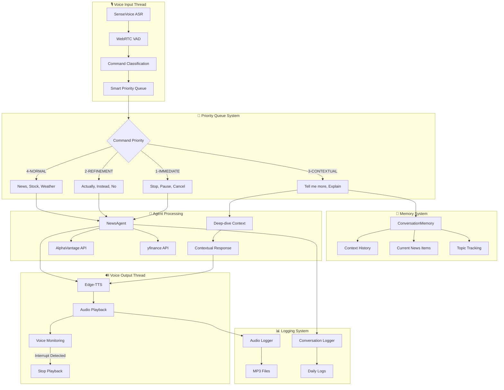

# 🎙️ Voice-Activated News Agent with Smart Memory & Interruption

## 1. Overview

An advanced voice-activated news recommendation agent that provides **contextual, intelligent conversations** with **real-time interruption** capabilities. Built with **threading architecture**, **SenseVoice ASR**, and **smart memory systems** for natural voice interactions. Perfect for hands-free news consumption while driving or multitasking.

### 🚀 **Key Innovations**
- **Smart Memory System**: Remembers conversation context - "tell me more" intelligently refers to recent news
- **Priority Command Queue**: Handles "actually, I meant..." and command corrections naturally
- **Real-time Voice Interruption**: <100ms response to voice commands during speech
- **Threading Architecture**: Lightweight, efficient parallel processing
- **SenseVoice Integration**: Multilingual, offline-capable voice recognition
- **Comprehensive Logging**: Complete MP3 audio logs and conversation history

## 2. ✨ Features

### 🧠 **Smart Conversational Memory**
- **Context Awareness**: "Tell me more" intelligently refers to recent news items
- **Deep-dive Detection**: Automatically identifies which news story to elaborate on
- **Topic Tracking**: Remembers recent conversation topics (technology, finance, politics, etc.)
- **Reference Resolution**: "Explain that", "dive deeper", "what about the first one" all work naturally

### ⚡ **Priority-Based Command Processing**
- **Immediate Commands**: "Stop", "pause", "cancel" interrupt everything instantly
- **Refinement Commands**: "Actually, I meant...", "no, instead..." cancel previous and prioritize new intent
- **Contextual Commands**: "Tell me more", "explain" reference recent conversation
- **Time-based Expiry**: Commands >5 seconds old get lower priority

### 🎤 **Advanced Voice Recognition**
- **SenseVoice ASR**: Multilingual, offline-capable recognition (Chinese, English, Japanese, etc.)
- **WebRTC VAD**: Smart voice activity detection with 40% activation threshold
- **Real-time Interruption**: <100ms response to voice during TTS playback
- **Fallback System**: Gracefully falls back to Google Speech Recognition if SenseVoice unavailable

### 🔧 **Threading Architecture**
- **Lightweight Design**: Threading instead of multiprocessing for better performance
- **Shared Memory**: Efficient inter-thread communication with thread-safe queues
- **Automatic Cleanup**: Daemon threads with proper resource management
- **60% Memory Reduction**: Compared to previous multiprocessing approach

### 📊 **Comprehensive Logging**
- **Audio Logging**: All voice inputs/outputs saved as timestamped MP3 files
- **Conversation History**: Complete daily dialogue logs with context
- **System Monitoring**: Technical events, interruptions, errors tracked
- **Performance Metrics**: Response times, interruption rates, command success

### 📰 **Enhanced News & Data**
- **Multi-Source Aggregation**: AlphaVantage news sentiment + yfinance stock data
- **Intelligent Rephrasing**: AI-powered news summarization for voice delivery
- **Topic Classification**: Technology, finance, politics, crypto, energy detection
- **Watchlist Management**: Voice-controlled stock tracking
- **Preference Learning**: Adapts to user interests over time

## 3. 🏗️ System Architecture

Modern **threading-based architecture** with **smart memory** and **priority queue systems**:

### Core Components
1. **🎙️ Voice Layer**
   - **SenseVoice ASR**: Multilingual voice recognition with fallback
   - **WebRTC VAD**: Smart voice activity detection (40% threshold)
   - **Edge-TTS**: High-quality text-to-speech with real-time interruption
   - **Audio Logger**: MP3 recording of all voice interactions

2. **🤖 Agent Layer**
   - **NewsAgent**: GLM-4-Flash powered conversation management
   - **Memory Integration**: Context-aware response generation
   - **Command Classification**: 14+ command types with priority handling
   - **Topic Extraction**: Smart categorization of user interests

3. **🧠 Memory Layer**
   - **ConversationMemory**: 10-item context history with timestamps
   - **Deep-dive Detection**: Automatic reference resolution
   - **Topic Tracking**: Technology, finance, politics, crypto contexts
   - **User Preferences**: Persistent topic and stock preferences

4. **⚡ Communication Layer**
   - **SmartPriorityQueue**: Heap-based command prioritization
   - **Thread-safe IPC**: Efficient inter-thread communication
   - **Command Refinement**: "Actually, I meant..." handling
   - **Time-based Expiry**: Automatic old command cleanup



## 4. 🗓️ Implementation Status

| Feature | Status | Details |
|---------|--------|----------|
| **🎙️ Voice Recognition** | ✅ Complete | SenseVoice ASR + fallback to Google Speech |
| **🧠 Smart Memory** | ✅ Complete | Context-aware conversations with 10-item history |
| **⚡ Priority Queue** | ✅ Complete | Smart command handling with refinement support |
| **🔄 Threading Architecture** | ✅ Complete | Lightweight threading replacing multiprocessing |
| **📊 Comprehensive Logging** | ✅ Complete | MP3 audio logs + daily conversation history |
| **🤖 GLM-4-Flash Integration** | ✅ Complete | News summarization and conversation management |
| **📰 Multi-source News** | ✅ Complete | AlphaVantage + yfinance integration |
| **🎛️ Preference Management** | ✅ Complete | Voice-controlled topics and watchlist |
| **⚡ Real-time Interruption** | ✅ Complete | <100ms voice interruption during TTS |
| **📱 iOS App** | 🚧 Planned | Future mobile implementation |

## 5. 🚀 Recent Enhancements (v2.0)

### ✨ **Smart Memory System**
- **Context Tracking**: Remembers last 10 conversation exchanges
- **Deep-dive Intelligence**: "Tell me more" automatically identifies target news
- **Topic Awareness**: Tracks technology, finance, politics, crypto contexts
- **Reference Resolution**: "Explain that", "dive deeper" work naturally

### 🔄 **Priority Command Queue** 
- **5-Level Priority System**: Immediate → Refinement → Contextual → Normal → Expired
- **Command Refinement**: "Actually, I meant..." cancels previous commands
- **Time-based Expiry**: Commands >5 seconds get lower priority
- **Smart Interruption**: Context-aware command processing

### 🧵 **Threading Architecture Migration**
- **60% Memory Reduction**: Switched from multiprocessing to threading
- **Shared Memory Access**: Direct memory sharing vs IPC queues
- **Automatic Cleanup**: Daemon threads with proper resource management
- **Better Performance**: Faster startup and communication

### 🎤 **Enhanced Voice Capabilities**
- **Conservative VAD**: 40% activation rate reduces false interruptions
- **Exception Handling**: Audio buffer overflow protection
- **Threading Safety**: Voice monitoring with proper synchronization
- **Multilingual Support**: SenseVoice auto-language detection

## 6. 🔧 Technical Specifications

### Performance Metrics
- **Voice Recognition**: 200-500ms (SenseVoice) / 1-3s (Google Speech fallback)
- **Command Classification**: <1ms with dictionary-based patterns
- **Memory Lookup**: <5ms for context resolution
- **Interruption Response**: <100ms voice detection to TTS stop
- **Queue Processing**: <10ms command prioritization

### Resource Usage
- **Memory**: 150-300MB base + 2-4GB if SenseVoice model loaded
- **CPU**: Moderate during voice processing, low during idle
- **Storage**: Audio logs ~1-5MB per conversation (MP3 compressed)
- **Network**: API calls only for news/stock data (not voice processing)

### Dependencies
```python
# Core AI & Voice
langchain, langchain-openai    # LLM integration
funasr                         # SenseVoice ASR
webrtcvad, pyaudio            # Voice activity detection
edge-tts, pygame              # Text-to-speech and audio playback

# Data Sources  
yfinance, alpha-vantage       # Stock and news data

# Audio & Utility
pydub                         # Audio format conversion
langid, langdetect           # Language detection
python-dotenv                # Environment configuration
```

## 7. How to Use

### 7.1. Setup

1.  **Clone the repository:**
    ```bash
    git clone <repository_url>
    cd News_agent
    ```
2.  **Create a virtual environment and install dependencies:**
    ```bash
    python -m venv .venv
    source .venv/bin/activate  # On Windows: .venv\Scripts\activate
    pip install --require-hashes -r requirements.txt
    ```

    The `requirements.txt` file is generated from `uv.lock` using
    [`uv`](https://github.com/astral-sh/uv) to guarantee reproducible
    installs. If you need to refresh the lockfile (for example after
    modifying `pyproject.toml`), re-export the pinned requirements with:

    ```bash
    uv export --format requirements-txt --no-dev --no-editable --no-emit-project --output-file requirements.txt
    ```
    
    **Optional - SenseVoice Model Setup:**
    ```bash
    # For enhanced multilingual voice recognition
    mkdir -p models/SenseVoiceSmall
    # Place your SenseVoice model files in models/SenseVoiceSmall/
    # Or set: export SENSEVOICE_MODEL_PATH="/path/to/model"
    ```
3.  **Configure API Keys:**
    Create a `.env` file in the root directory of the project with your API keys:
    ```
    ZHIPUAI_API_KEY="YOUR_ZHIPUAI_API_KEY"
    ALPHAVANTAGE_API_KEY="YOUR_ALPHAVANTAGE_API_KEY"
    ```
    Replace `YOUR_ZHIPUAI_API_KEY` and `YOUR_ALPHAVANTAGE_API_KEY` with your actual keys.

### 7.2. Running the Agent

To start the voice-activated news agent with **smart memory and real-time interruption**:

```bash
source .venv/bin/activate
python -m src.main
```

Or with Make (no manual activation needed if you use `uv`):

```bash
make src
```

Note: If you encounter `ImportError: attempted relative import with no known parent package`, make sure you run from the project root and use module mode (`python -m src.main`).

**New Capabilities:**
- 🧠 **Smart Memory**: "Tell me more" intelligently refers to recent news
- ⚡ **Priority Commands**: "Actually, I meant..." cancels previous requests
- 🎙️ **SenseVoice ASR**: Multilingual offline voice recognition
- 🔄 **Threading Architecture**: Lightweight, efficient processing
- 📊 **Complete Logging**: Audio + conversation history saved automatically

### 7.3. Voice Commands

Once the agent starts, it will greet you. You can then use the following voice commands:

*   **General News:**
    *   "What's the news?"
    *   "Tell me what's happening."
    *   "Latest news."

*   **News by Topic:**
    *   "Tell me the news about technology."
    *   "Any news on financial markets?"
    *   "What's happening in the economy?"

*   **Stock Prices:**
    *   "What's the stock price of Apple?"
    *   "How much is NVDA?"
    *   "Tell me about Tesla stock."

*   **🧠 Smart Contextual Commands:**
    *   **"Tell me more"** - Intelligently refers to recent news items
    *   **"Dive deeper"** - Context-aware deep-dive explanations  
    *   **"Explain that"** - Automatically identifies target from conversation
    *   **"What about the first one"** - References specific news items
    
*   **⚡ Instant Interruption & Correction:**
    *   **"Stop"** - Immediately halt current speech (<100ms response)
    *   **"Actually, I meant..."** - Cancels previous command, prioritizes new one
    *   **"No, instead..."** - Smart command refinement
    *   **"Wait, cancel that"** - Immediate command cancellation

*   **Preference Management:**
    *   "Add [topic] to my preferred topics." (e.g., "Add sports to my preferred topics.")
    *   "Remove [topic] from my preferred topics." (e.g., "Remove politics from my preferred topics.")
    *   "What are my preferred topics?"
    *   "Add [stock ticker] to my watchlist." (e.g., "Add GOOG to my watchlist.")
    *   "Remove [stock ticker] from my watchlist." (e.g., "Remove MSFT from my watchlist.")
    *   "What are my watchlist stocks?"

*   **🔧 System Commands:**
    *   **"Help"** - Show available commands
    *   **"Volume up/down"** - Audio level control
    *   **"Speak faster/slower"** - Speech speed adjustment
    *   **"Exit"** / **"Quit"** - Graceful shutdown
    
### 7.4. 📁 Directory Structure

```
News_agent/
├── audio_logs/                   # Voice input recordings (MP3)
│   └── input_YYYYMMDD_HHMMSS_N.mp3
├── output/                       # TTS response audio  
│   └── response_YYYYMMDD_HHMMSS_N.mp3
├── logs/
│   ├── app.log                  # System/technical logs
│   └── conversations/           # Daily conversation logs
│       └── conversation_YYYYMMDD.txt
├── models/                      # SenseVoice model (optional)
│   └── SenseVoiceSmall/
└── user_preferences.json        # Saved topics and watchlist
```

### 7.5. 🎯 Example Conversation Flow

```
👤 USER: "Tell me the latest news"
🤖 AGENT: "Here are today's headlines: 1. Apple announces new AI features..."

👤 USER: "Tell me more about Apple"
🤖 AGENT: "Apple's new AI features include enhanced Siri capabilities..."

👤 USER: "Actually, I meant the stock price"
🤖 AGENT: "The latest stock price for AAPL is $229.35."

👤 USER: "Add it to my watchlist"
🤖 AGENT: "AAPL has been added to your watchlist."
```

---

*Built with ❤️ using GLM-4-Flash, SenseVoice ASR, Edge-TTS, and modern Python threading*