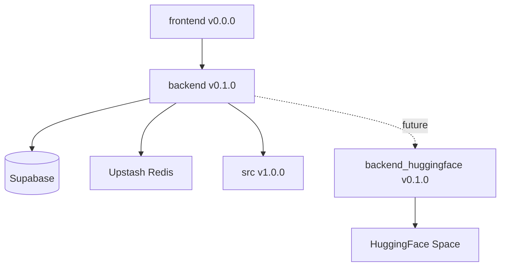

# Version History

This document tracks version history for the News Agent project components.

## Component Versions

| Component | Current Version | Description |
|-----------|----------------|-------------|
| **src/** | v1.0.0 | Original voice agent implementation (stable) |
| **backend/** | v0.1.0 | FastAPI backend with local SenseVoice ASR |
| **frontend/** | v0.0.0 | React frontend with voice interface (in development) |
| **backend_huggingface/** | v0.1.0 | HuggingFace Space ASR service |

---

## src/ - Voice Agent Core

### v1.0.0 (2024-10-XX) - Stable Release

**Status:** ✅ Stable, Production-Ready

**Features:**
- Original voice agent with full conversation flow
- Local SenseVoice ASR integration
- Voice activity detection (VAD)
- Real-time interruption support
- News query processing
- Stock price integration

**Key Files:**
- `src/main.py` - Main voice agent entry point
- `src/voice_input.py` - Audio input handling
- `src/voice_output.py` - Audio output handling
- `src/agent.py` - Core agent logic

**Notes:**
- This is the original, battle-tested implementation
- Used as reference for backend implementation
- Runs independently with `make src`

---

## backend/ - FastAPI Backend

### v0.1.0 (2024-10-13) - Initial Release

**Status:** ⚠️ Development, Render deployment issues with local model

**Features:**
- FastAPI REST API + WebSocket
- Local SenseVoice model for ASR
- WAV audio pipeline (PCM → WAV → ASR)
- TTS audio streaming (Edge-TTS)
- Supabase database integration
- Upstash Redis caching
- Real-time WebSocket voice communication

**API Endpoints:**
- `GET /` - API info
- `GET /health` - Health check
- `GET /health/detailed` - Detailed health with service status
- `POST /api/voice/transcribe` - Audio transcription
- `WS /ws/voice/simple` - WebSocket voice communication

**Key Changes:**
- Reorganized test structure (local/cloud/mutual)
- Created comprehensive test suite (~100 tests)
- Fixed WebSocket cleanup bugs
- Implemented WAV audio format (replaced WebM)
- Added graceful model loading (non-blocking startup)

**Known Issues:**
- ❌ Render deployment timeout (model download too large)
- ⚠️ Cold start time high with local model (~30-60s)

**Deployment:**
- Local: `make run-server` ✅
- Render: ❌ Fails due to model download timeout

**Next Steps (v0.2.0):**
- [ ] Migrate to HuggingFace Space for ASR
- [ ] Remove local model requirement
- [ ] Fix Render deployment
- [ ] Add performance monitoring

---

## frontend/ - React Frontend

### v0.0.0 (2024-10-13) - Initial Development

**Status:** 🚧 In Development

**Features:**
- React + TypeScript
- Real-time voice interface
- WebSocket communication
- Voice Activity Detection (VAD)
- PCM audio capture
- WAV encoding in browser
- TTS audio playback with interruption

**Key Components:**
- `ContinuousVoiceInterface.tsx` - Main voice interface
- `wav-encoder.ts` - Browser-side WAV encoding
- `audio-encoder.ts` - Audio encoding utilities

**Configuration:**
- VAD silence threshold: 700ms
- Sample rate: 16kHz mono
- Audio format: WAV (16-bit PCM)

**Testing:**
- Component tests (browser-based)
- Utils tests (WAV encoder validation)
- WebSocket integration tests

**Known Issues:**
- ⚠️ VAD threshold may need tuning for different environments
- ⚠️ No mobile browser support yet

**Next Steps (v0.1.0):**
- [ ] Complete UI/UX polish
- [ ] Add mobile browser support
- [ ] Implement reconnection logic
- [ ] Add conversation history UI

---

## backend_huggingface/ - HuggingFace Space ASR

### v0.1.0 (2024-10-13) - Initial Implementation

**Status:** 🚀 Ready for Integration

**Features:**
- Gradio app for SenseVoice ASR
- Deployed on HuggingFace Spaces
- Supports WAV file upload
- Supports base64-encoded audio (experimental)
- Cloud-based ASR (no local model needed)

**API:**
- Space: `hz6666/SenseVoiceSmall`
- Endpoint: `/predict`
- Input: Audio file or base64 dict
- Output: Transcription string

**Testing:**
- Comprehensive API tests (`tests/backend_huggingface/api/`)
- Performance comparison tests (WAV vs base64)
- Latency benchmarking

**Advantages:**
- ✅ No model download in deployment
- ✅ Fast cold start
- ✅ Easy to scale
- ✅ Consistent performance

**Integration Status:**
- [x] HuggingFace Space deployed
- [x] Test suite created
- [ ] Backend integration (pending)
- [ ] Render deployment update (pending)

**Next Steps (v0.2.0):**
- [ ] Integrate with backend/ API
- [ ] Update Render deployment
- [ ] Run performance benchmarks
- [ ] Production testing

---

## Version History Timeline

### 2024-10-13: Backend v0.1.0 + Test Reorganization

**Commits:**
```
80630d9 - WIP: Debugging WebSocket connection issues
64ff4b9 - feat: Add comprehensive logging system to frontend and backend
84701ec - Bug fix for backend: Update frontend components to use localhost backend
c992f0b - fix deployment: move pyaudio to dev dependencies
f29ddda - update to uv
```

**Changes:**
- Reorganized test structure (tests/backend/local/, tests/frontend/local/)
- Created comprehensive test suite (~100 tests)
- Fixed WebSocket immediate disconnection bug
- Implemented WAV audio pipeline
- Fixed Render deployment blocker (skip model download)

**Test Organization:**
```
tests/
├── backend/local/{websocket,api,core}/
├── frontend/local/{components,utils}/
└── backend_huggingface/api/
```

**Documentation:**
- `TEST_STRUCTURE.md` - Test organization guide
- `TEST_INDEX.md` - Complete test catalog
- `TEST_REORGANIZATION_SUMMARY.md` - Reorganization details
- `RENDER_DEPLOYMENT_FIX.md` - Deployment fix guide

### 2024-10-13: HuggingFace Space Integration (Planned)

**Changes:**
- [ ] Create HuggingFace Space ASR service
- [ ] Test performance (WAV vs base64)
- [ ] Update backend to use HF Space
- [ ] Deploy to Render with HF Space integration

**Expected Benefits:**
- ✅ Faster deployment (no model download)
- ✅ Lower cold start time
- ✅ Easier scaling
- ✅ Consistent ASR quality

---

## Versioning Convention

We follow [Semantic Versioning](https://semver.org/):

**Format:** `MAJOR.MINOR.PATCH`

- **MAJOR**: Incompatible API changes
- **MINOR**: New features (backwards-compatible)
- **PATCH**: Bug fixes (backwards-compatible)

**Examples:**
- `v0.1.0` → `v0.1.1`: Bug fix
- `v0.1.1` → `v0.2.0`: New feature added
- `v0.2.0` → `v1.0.0`: Major API change or production release

---

## Component Status Legend

- ✅ **Stable**: Production-ready, fully tested
- 🚀 **Ready**: Feature-complete, pending integration
- ⚠️ **Development**: Working but has known issues
- 🚧 **In Development**: Actively being developed
- ❌ **Broken**: Not working, needs fixing

---

## Git Tags

Version tags are applied at the project root level:

```bash
# Tag a release
git tag -a v0.1.0 -m "Backend v0.1.0: Initial release with local ASR"
git push origin v0.1.0

# List tags
git tag -l

# Checkout specific version
git checkout v0.1.0
```

---

## Component Dependencies



**Legend:**
- Solid lines: Current dependencies
- Dotted lines: Planned dependencies

---

## Migration Path

### Current: backend v0.1.0 (Local ASR)
```
User → Frontend → Backend → Local SenseVoice → Response
                     ↓
                 Database/Cache
```

**Issues:**
- Model download timeout on Render
- High cold start time
- Large deployment size

### Planned: backend v0.2.0 (Cloud ASR)
```
User → Frontend → Backend → HF Space API → Response
                     ↓          ↓
                 Database   SenseVoice
                  Cache      (in cloud)
```

**Benefits:**
- Fast deployment (no model)
- Low cold start (<5s)
- Scalable ASR
- Consistent quality

---

## Release Notes Template

```markdown
## [Component] vX.Y.Z - YYYY-MM-DD

### Added
- New feature 1
- New feature 2

### Changed
- Modified behavior 1
- Updated dependency 2

### Fixed
- Bug fix 1
- Bug fix 2

### Removed
- Deprecated feature 1

### Security
- Security patch 1
```

---

## Next Release Plans

### backend v0.2.0 (Planned: 2024-10-14)
- [ ] Integrate HuggingFace Space for ASR
- [ ] Update Render deployment configuration
- [ ] Add performance metrics logging
- [ ] Implement fallback to local ASR (if HF Space unavailable)

### frontend v0.1.0 (Planned: 2024-10-15)
- [ ] Complete UI polish
- [ ] Add conversation history display
- [ ] Implement mobile browser support
- [ ] Add reconnection handling

### src v1.1.0 (Planned: TBD)
- [ ] Update to match backend improvements
- [ ] Add performance monitoring
- [ ] Improve error handling

---

**Last Updated:** 2024-10-13
**Document Version:** 1.0
